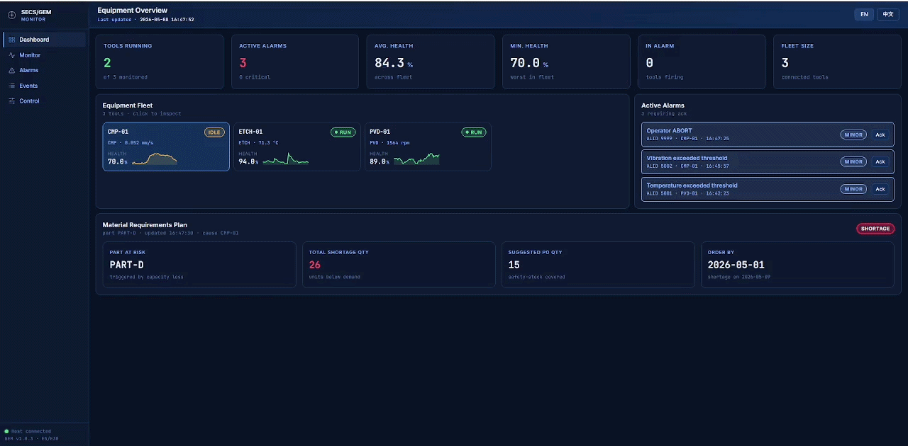

# 🏭 智慧製造事件驅動 MRP 系統

📘 English version: [README.md](README.md)



---

## 📌 專案概述

在真實工廠裡，三個團隊各自盯著三個世界：

- **設備工程師**——盯機台、警報、SECS/GEM 訊號
- **生產規劃**——決定每一台機台跑什麼料號
- **採購**——根據下個月的計畫去訂原料

這三個團隊平常很少在「即時」溝通。一台關鍵機台早上 10:03 出狀況，採購通常要過好幾天才會知道——等表格重做完、會議開完之後。

這個專案就是要把這個延遲縮短成「秒」。一條 SECS/GEM 警報，會在幾秒鐘內變成重新算過的生產計畫和一筆採購建議——整條因果鏈用同一個 `correlation_id` 串起來。

它回答了一個關鍵問題：

👉 「機台壞掉的時候，生產跟採購會怎樣？」

---

## 🔄 系統流程

```
   設備（SECS/GEM 事件）
              │
              ▼
   ┌──────────────────────────┐
   │   單一事件流              │  ← 一份可稽核的記錄
   │   （警報 · 狀態 · 確認）  │
   └────────────┬─────────────┘
                │
   ┌────────────┼─────────────┬──────────────┐
   ▼            ▼             ▼              ▼
 產能追蹤    即時          MRP 計算         操作者
            儀表板         + 採購建議       指令
```

下游所有子系統都在反應同一條事件流。沒有跨團隊 API 呼叫、沒有夜間批次、也沒有「我們之後再 sync」這件事。

📊 完整流程圖：[`system_flow.png`](system_flow.png)

---

## 🚀 主要功能

### 🔧 即時設備監控

- 講的是真半導體廠在用的 **SECS/GEM** 協定（HSMS、S6F11、S5F1、S2F41）
- 即時追蹤每台機台的狀態——RUN / IDLE / ALARM
- Telemetry（溫度、振動、轉速）即時串到儀表板

---

### 📈 生產風險可視化

- 每一筆機台警報都進到同一份可稽核的事件流
- 機台一停機，**產能損失**馬上算出來
- 直接看到哪些料號會受影響、影響多少

---

### 📦 缺料風險預測

- 產能一掉，MRP 自動重算
- 把未來 **30 天**內可能的缺料風險標出來
- 提供採購建議——數量、日期，並串連到造成問題的那條警報

👉 「需求」不等於「實際做得出來的量」，計畫會根據現實調整。

---

### 📊 操作者儀表板（含稽核）

- 即時機台總覽、telemetry 圖表、進行中警報
- 每台機台一鍵執行 **START / STOP / PAUSE / RESUME / RESET / ABORT**
- 每一次操作都有紀錄——即使是被拒絕的指令也會被留下來

---

## 🏗 系統架構

整個系統是一條分層的事件驅動 pipeline：

### 1. 設備層（Equipment Layer）
- HSMS host adapter 走 SECS/GEM
- 每台機台獨立追蹤狀態

### 2. 事件層（Event Layer）
- 單一事件流——所有事實都用 append，從不覆蓋
- Transactional outbox 確保資料庫寫入跟事件發布之間不會掉

### 3. 邏輯層（Logic Layer）
- 產能追蹤、MRP 重算、採購建議產生
- 每個 subscriber 各自負責一個 read model

### 4. 資料層（Data Layer）
- **MySQL**：設備事件、MRP 計畫、停機紀錄
- **PostgreSQL**：訂單與報表

### 5. 視覺化層（Visualization Layer）
- React 儀表板，讀的是專門設計的 CQRS view

---

## 🛠️ 技術棧

- Python + Flask
- React（單頁儀表板）
- MySQL 8（事件儲存 + read model）
- PostgreSQL（訂單與業務側）
- SECS/GEM via `secsgem`（HSMS 傳輸）
- Docker + Docker Compose
- 自製 IoT 與 SECS 設備模擬器

---

## ⚡ 快速啟動

```bash
git clone https://github.com/both1108/secsgem-mrp.git
cd secsgem-mrp

cp .env.example .env

docker compose up -d
docker compose logs -f app
```

開瀏覽器：

```
http://localhost:8000   # 儀表板
http://localhost:5000   # API
```

如果不想用 Docker、要從原始碼跑：

```bash
pip install -r requirements.txt
python app.py
```

跑測試：

```bash
pytest tests/
```

---

## ⚙️ 環境變數

`.env` 範例：

```env
# MySQL（事件儲存 + read model）
MYSQL_HOST=mysql
MYSQL_PORT=3306
MYSQL_USER=root
MYSQL_PASSWORD=root
MYSQL_DB=erp

# PostgreSQL（訂單與業務側）
PG_HOST=postgres
PG_PORT=5432
PG_USER=user
PG_PASSWORD=password
PG_DB=transactions

# 訊號來源 — tailer | secsgem | both
SIGNAL_SOURCE=secsgem
```

---

## 🤖 SECS/GEM 設備模擬器

- 跟主程式一起用 Docker 跑
- 模擬三台機台（M-01 / M-02 / M-03，分別跑 PART-A 與 PART-B）
- 持續產生 SECS/GEM 流量
- 自動觸發警報跟復原——可以直接看整條 pipeline 怎麼反應

---

## 📖 真實場景範例

時間是早上 10:03，機台 **M-01** 正在跑 PART-A。

1. **10:03:17**——M-01 的冷卻液溫度超過閾值。設備發出 S6F11 警報。
2. **10:03:17**——Pipeline 把警報寫進事件流，把 M-01 切到 ALARM，並開一筆停機區間。
3. **10:03:22**——MRP 用最新的產能損失資料，重算 30 天計畫。
4. **10:03:22**——採購建議跑出來：*「在 2026-05-12 之前，採購 RAW-X 3,200 件。」*
5. **10:04**——生產規劃打開儀表板，建議已經在那裡了。點一下就可以順著看回去：採購建議 → MRP 計畫 → 停機 → 原始 M-01 警報。
6. **10:47**——技術員把 M-01 重置。停機區間關閉，MRP 用「實際損失」再跑一次，採購建議跟著更新。

整段流程沒人開試算表，沒人寄 email。生產規劃還沒喝完咖啡，工廠的紀錄已經是正確的。

---

## 🎯 重點觀察

這個專案點出了幾個真實製造現場的痛點：

- 機台停機會「**立刻**」影響產能——系統應該秒級反應，不該是天級
- 「需求預測」跟「實際做得出來的量」**不是同一個數字**
- 缺料應該**事前預測**，不是事後發現
- 每一個業務決策都應該**可追溯**回造成它的那筆設備事件

---

## 🧠 這個專案展現了什麼

- **設備 → 生產 → 採購** 完整 end-to-end 整合，全部走同一條事件 pipeline
- 真正的 **SECS/GEM 協定支援**——不是 mock，也不是 REST 模擬
- 設計的是**決策支援系統**，不是靜態報表
- 把真實工廠的營運問題，翻譯成乾淨的軟體架構

---

## 👤 給 HR / 招募者

這個專案是**真實晶圓廠或電子廠裡會跑的那種系統**——不是學校作業，不是 CRUD app。它把三個完全不同的世界（機台、生產規劃、採購）串成一個即時運作的系統。

實際在做的事情：

- **它即時聽工廠設備在說什麼**，用的就是真半導體廠在用的那個協定
- 機台一壞，**自動算出產能影響**，並且建議採購怎麼調整
- **每一個決策都可以追溯**回最初那條設備事件——這是受規範產業要求的稽核軌跡
- **跑成一條完整的 pipeline**，不是一堆斷掉的畫面

作者一個人從頭到尾蓋完：設備側的協定層、事件驅動的中間層、生產規劃的邏輯層、操作者的儀表板。

---

## 💼 履歷可寫的亮點

- 從零打造一條事件驅動的製造 pipeline，把 SECS/GEM 設備警報轉換成可稽核的 MRP 與採購決策
- 設計 per-machine 狀態機，含「會尊重 safety alarm」的操作者覆蓋邏輯（SEMI E10 / E94 語意）
- 用同一個 `correlation_id`，把「設備 → 生產 → 業務」的稽核鏈完整串起來
- 從零實作 SECS/GEM 傳輸層（HSMS、S6F11、S5F1、S2F41），並設計可替換的訊號來源層
- 用 CQRS read model，讓儀表板在熱路徑上不需要 join

---

## 💡 未來擴充方向

- **批次系譜（Lot genealogy）**——把警報跟當時在機台裡的晶圓綁起來
- **預測性維護**——警報還沒響之前就抓 drift
- **班別產能**——按小時跟星期幾算效率
- **OEE 彙總**——Availability × Performance × Quality 每天投影
- **ERP 整合**——直接接 PO 流程
- **Streaming broker**（Kafka / Redis Streams）——規模超過一台機器的時候

---

## ⚠️ 限制說明

這個專案是 POC（概念驗證）性質，目前不包含：

- 詳細的生產排程與路由
- 供應商特定的交期與最小訂購量限制
- 認證 / 正式環境級的安全性
- 串流基礎設施（Kafka / Spark）

它的重點是驗證整合模型跟決策邏輯，不是要直接上線。

---

📘 English version: [README.md](README.md)
